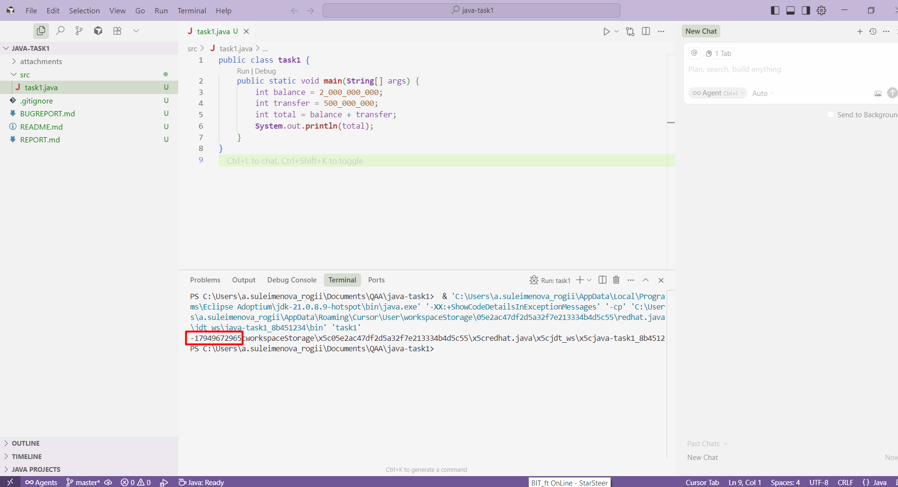

**Summary (EN):** [Money Transfer] Incorrect result when calculating total balance  

**Preconditions:**  
Открыт публичный банковский сервис «Money Transfer».  
У клиента на счёте имеется баланс 2 000 000 000 рублей.

**Steps:**  
1. Выполнить операцию пополнения счёта на сумму 500 000 000 рублей.  
2. Проверить итоговый баланс после выполнения операции.  

**Expected result:**  
Итоговый баланс равен 2 500 000 000 рублей.  

**Actual result:**  
Итоговый баланс отображается как отрицательное значение: -1 794 967 296 рублей.  

**Comment:**  
Проблема воспроизводится стабильно при каждой операции пополнения.  

**Attachments:**  

